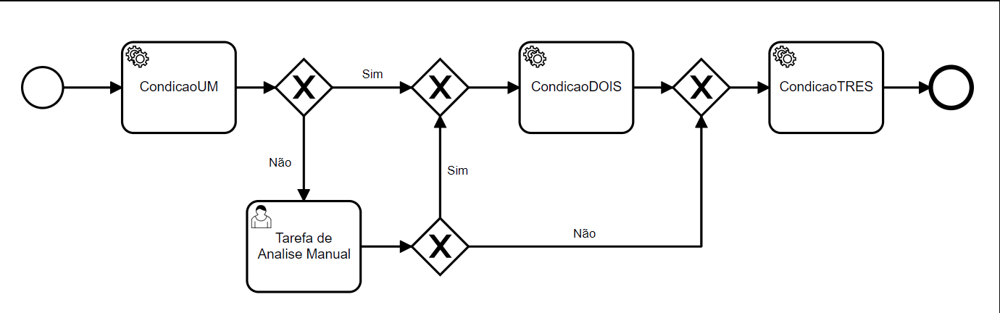
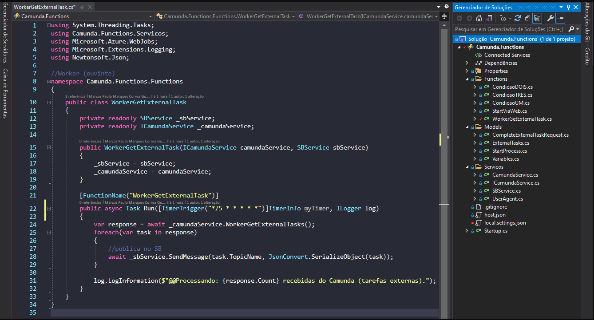
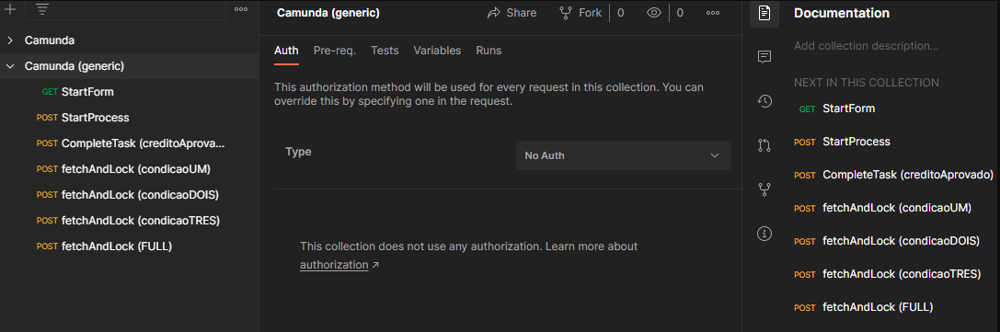
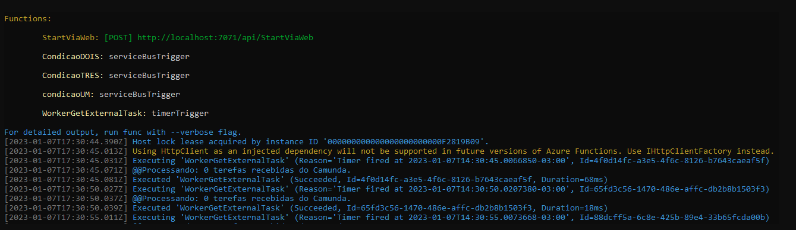
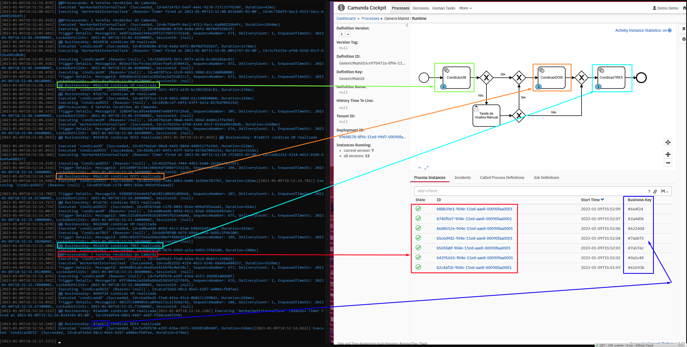
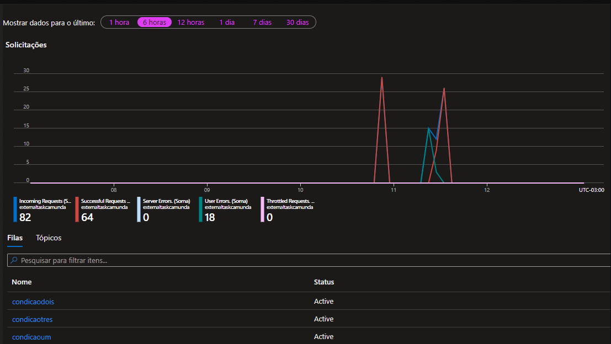

<h1 align="center">External Tasks 
(Azrure Functions, Servicebus, .NET, C#)</h1>
<a name="back-to-top">

  

         
    
    
    
    
    
      
  
 

 

  ## 🔎 Índice
  - [BPMN Base](#bpmn-base)
  - [Estrutura do Projeto](#estrutura-projeto)
  - [Collection](#collection)
  - [Filas e Comunicação com Servicebus](#filas-servicebus)
  - [Tecnologias Utilizadas](#tec-utilizadas)
  - [Console execução Functions](#exec-function)
  - [Visualização Funcionamento do Processo (log)](#exec-function-log)
  - [Como Rodar o Projeto](#rodar-projeto)

 

<a name="bpmn-base">

  ## 📄 BPMN Base 
 

 

<a name="estrutura-projeto">

  ## 👨‍💻 Estrutura do Projeto
  #### _(Worker(ouvinte) + quatro Functions genéricas referentes a estrutura da BPMN)_
 

 

<a name="collection">

  ## 📚 Collection
   

  
 

<a name="exec-function">

  ## ⚡ Console execução Functions
  #### _(Filas e Worker, todas as etapas possuem log. São precedidos por "@@")_ 
   

  
 

<a name="exec-function-log">

  ## ⚡ Visualização Funcionamento do Processo (log)  
   

  
 

<a name="filas-servicebus">

  ## 🚌 Filas e Comunicação com Servicebus 
   

  
 

<a name="rodar-projeto">

  ## ⚙️ Como Rodar o Projeto
  <h4><i>(Tópico genérico para ser usado como tasklist)</i></h4>
  <h4><i>(Pré requisitos: SDK .NET e JDK 15)</i></h4>

- Clonar repositório
- incluir as seguintes propriedades no local.settings.json com os seus respectivos dados:
  - CamundaUrl
  - ServiceBusConnectionString
- Criar Servicebus com as seguintes filas (Nomes genéricos utilizados no projeto): 
  - condicaoum
  - condicaodois
  - condicaotres
- Iniciar o projeto
- Importar Collection no Postman
- Abrir arquivo BPMN no Camunda: genenericMain.bpmn
- Iniciar servidor escolhido: Tomcat, Docker(image) ou Camunda Run
- Implantar Camunda
- Iniciar um processo atraves da rota POST|StartProcess

 
 
<a name="tec-utilizadas">

  ##     Tecnologias Utilizadas

  - [**Azure Functions**](https://azure.microsoft.com/pt-br/products/functions)    [(*Documentação*)](https://learn.microsoft.com/pt-BR/azure/azure-functions/)
  - [**Camunda**](https://camunda.com/)    [(*Documentação*)](https://docs.camunda.io/)
  - [**Camunda Desktop Modeler**](https://camunda.com/download/modeler/)    [(*Documentação*)](https://docs.camunda.org/manual/latest/introduction/third-party-libraries/?__hstc=252030934.4ac1f27b1db0ceeb20f17898b27cf3ba.1673104365466.1673104365466.1673104365466.1&__hssc=252030934.11.1673104365467&__hsfp=1123496843)
  - [**Camunda Platform Run**](https://camunda.com/download/)    [*(Documentação)*](https://docs.camunda.org/manual/latest/installation/full/)
    - Outras opções de servidores:
      - [**Docker**](https://www.docker.com/)    [*(Documentação)*](https://docs.camunda.org/manual/latest/installation/docker/?__hstc=252030934.4ac1f27b1db0ceeb20f17898b27cf3ba.1673104365466.1673104365466.1673104365466.1&__hssc=252030934.13.1673104365467&__hsfp=1123496843)
      - [**Tomcat**](https://tomcat.apache.org/)    [(*Documentação*)](https://docs.camunda.org/manual/latest/installation/full/tomcat/pre-packaged/?__hstc=252030934.4ac1f27b1db0ceeb20f17898b27cf3ba.1673104365466.1673104365466.1673104365466.1&__hssc=252030934.13.1673104365467&__hsfp=1123496843)
  - [**C#**](https://dotnet.microsoft.com/en-us/learn/csharp)    [(*Documentação*)](https://learn.microsoft.com/pt-br/dotnet/csharp/?WT.mc_id=dotnet-35129-website)
  - [**JDK 15**](https://jdk.java.net/)    [(*Documentação*)](https://www.oracle.com/java/technologies/javase/jdk15-archive-downloads.html)
  - [**.NET**](https://dotnet.microsoft.com/pt-br/)    [(*Documentação*)](https://learn.microsoft.com/pt-br/dotnet/?WT.mc_id=dotnet-35129-website)
  - [**Postman**](https://www.postman.com/)    [(*Documentação*)](https://learning.postman.com/docs/getting-started/introduction/)
  - [**Servicebus**](https://azure.microsoft.com/pt-br/products/service-bus)    [(*Documentação*)](https://learn.microsoft.com/pt-BR/azure/service-bus-messaging/service-bus-dotnet-get-started-with-queues?tabs=passwordless)

  

&emsp;&emsp;&emsp;&emsp;&emsp;&emsp;&emsp;&emsp;&emsp;&emsp;&emsp;&emsp;&emsp;&emsp;&emsp;&emsp;&emsp;&emsp;&emsp;&emsp;⬆️[**Back to top**](#back-to-top)⬆️
